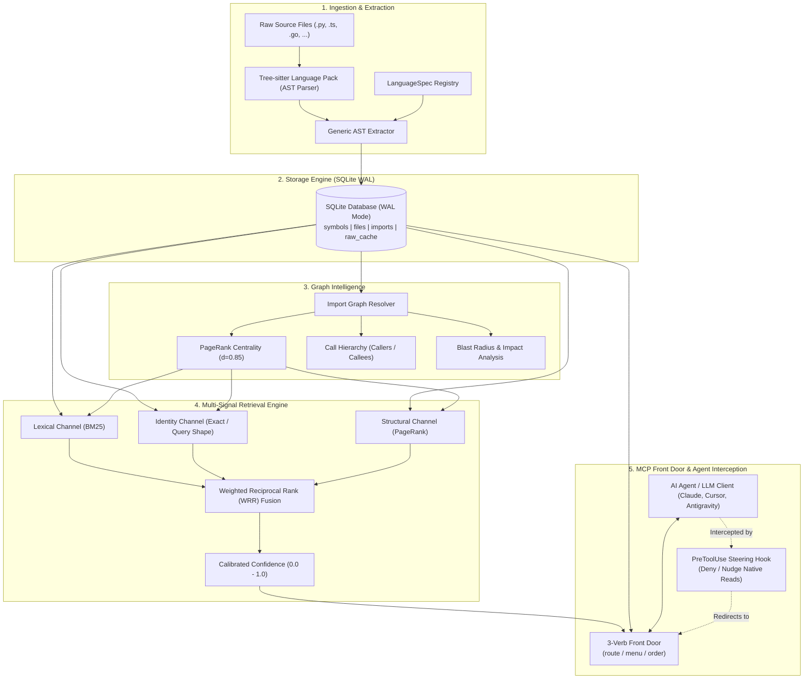

# CodePrism Architecture & Engineering Master Plan

> **Project Name:** `CodePrism` (`codeprism`)
> **System Goal:** A local-first, symbol-level code intelligence system and MCP server for AI coding agents.
> **Core Axiom:** *Retrieval precision is more efficient than brute-force context expansion.* (Move from "Read everything to find something" to "Find something, then read only that.")

---

## 1. System Architecture Overview

---

## 2. The 7 Phased Milestones

| Phase | Milestone Name | Key Artifacts & Concepts |
| :--- | :--- | :--- |
| **Phase 1** | **Foundation & Data Contracts** | `Symbol` schema, Stable Symbol IDs (`file::name#kind`), `ByteSlicedSource` (solving UTF-8 coordinate drift). |
| **Phase 2** | **Tree-Sitter AST Parsing** | `LanguageSpec` registry, multi-language AST extraction, parameter lists, docstrings, overload disambiguation (`~1`, `~2`), content hashing. |
| **Phase 3** | **SQLite WAL Storage Engine** | SQLite database schema (`symbols`, `files`, `imports`, `raw_cache`), WAL concurrency, incremental change detection via mtime & SHA-256. |
| **Phase 4** | **Import Graph & Intelligence** | Cross-file import resolution, PageRank graph centrality algorithm, AST-derived Call Hierarchy, Blast Radius. |
| **Phase 5** | **Hybrid Search & Fusion Engine** | BM25 indexing, Query Shape analysis (CamelCase/snake_case pinning), Weighted Reciprocal Rank (WRR) fusion, Calibrated confidence score. |
| **Phase 6** | **The 3-Verb Front Door & MCP Server** | FastMCP server implementation, `route`, `menu`, `order`, state-change guardrails, token budget packing, live token savings counter. |
| **Phase 7** | **Agent Steering Hooks & Hardening** | PreToolUse hook (redirecting `Read`/`Grep`/`Glob`/`Bash`), file-watching daemon (`watchfiles`), and test ratchets. |

---

## 3. Guiding Engineering Principles

1. **Exact Coordinate Seeking:** Slices are addressed by byte offsets into raw files, never by line approximations or regex guesses.
2. **The 4-State Verdict Contract:** Every search returns one of four states:
   - `ok`: Confident matches found.
   - `low_confidence`: Weak matches found; verify before relying.
   - `absent`: Corpus was thoroughly scanned; item definitively does not exist (prevents hallucination).
   - `degraded`: Index is rebuilding or partial; silence proves nothing.
3. **Pessimistic Savings Accounting:** The savings meter only errs downward. Never count phantom savings; measure in raw tokens, never in floating currency rates.
4. **Hard Schema Budget:** The entire tool declaration footprint must stay strictly bounded so the server does not consume the context window it was built to save.
